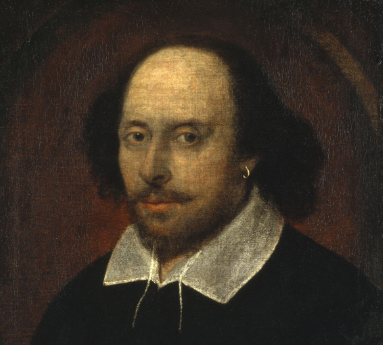
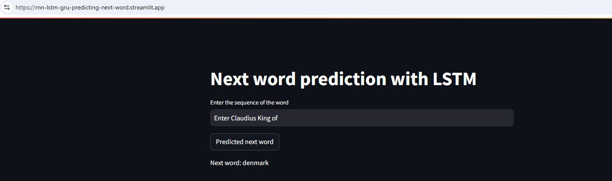

# RNN-LSTM-GRU-Predicting-Next-Word

William Shakespeare ( c. 23 April 1564 – 23 April 1616)
# Project:
Aim of the project to predict the next word with LSTM RNN, trained on the text of Shakespeare's Hamlet.

# Streamlit App
Try demo [here](https://rnn-lstm-gru-predicting-next-word.streamlit.app/)

# LSTM Model
